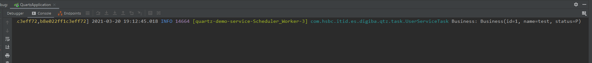

## Quartz
Quartz is a richly featured, open source job scheduling library that can be integrated within virtually any Java application - from the smallest stand-alone application to the largest e-commerce system.

### 1. quartz-common
please find quartz-common project to get more details.

### 2. Integration 

```xml
        <dependency>
            <groupId>com.hsbc.itid.es.digiba</groupId>
            <artifactId>quartz-common</artifactId>
            <version>1.0</version>
        </dependency>
```

```yaml
spring:
  application:
    name: quartz-demo-service
  datasource:
    dynamic:
      enable: true
    core:
      jdbcUrl: jdbc:mysql://127.0.0.1:3306/release?useUnicode=true&characterEncoding=utf-8&allowMultiQueries=true&useSSL=false&serverTimezone=Asia/Shanghai&allowPublicKeyRetrieval=true
      username: root
      password: 123456
      driver-class-name:  com.mysql.cj.jdbc.Driver
    quartz:
      jdbcUrl: jdbc:mysql://127.0.0.1:3306/quartz?useUnicode=true&characterEncoding=utf-8&allowMultiQueries=true&useSSL=false&serverTimezone=Asia/Shanghai&allowPublicKeyRetrieval=true
      username: root
      password: 123456
      driver-class-name:  com.mysql.cj.jdbc.Driver
```

```java
package com.hsbc.itid.es.digiba.qtz;

import com.hsbc.itid.es.digiba.quartz.EnableQuartz;
import org.mybatis.spring.annotation.MapperScan;
import org.springframework.boot.SpringApplication;
import org.springframework.boot.autoconfigure.SpringBootApplication;
import org.springframework.boot.autoconfigure.jdbc.DataSourceAutoConfiguration;

@SpringBootApplication(exclude = {DataSourceAutoConfiguration.class})
@EnableQuartz
@MapperScan(
        basePackages = {"com.hsbc.itid.es.digiba.quartz.mapper","com.hsbc.itid.es.digiba.qtz.dao"}
)
public class QuartzApplication {

    public static void main(String[] args) {
        SpringApplication.run(QuartzApplication.class,args);
    }

}
```

create scheduler job business
```java
@Component("userTask")
@Slf4j
public class UserServiceTask {

    @Autowired
    private ObjectMapper objectMapper;

    public void release(String params) throws JsonProcessingException {
        Business business = objectMapper.readValue(params,Business.class);
        log.info("Business: {} ",business);
    }

```

### 3. Testing

#### 3.1 custom time scheduler job
 
post a request to http://127.0.0.1:8080/monitor/job/add

    jobName:Job Name
    jobGroup:quartz-demo-service
    invokeTarget:userTask.release()
    concurrent:0
    status:0
    misfirePolicy:2
    params:{↵	"id": "1",↵	"name": "test",↵	"status": "P"↵}
    triggerType:1
    startTime:2021-03-20 19:12:45



#### 3.2 cron scheduler job
post a request to http://127.0.0.1:8080/monitor/job/add

    jobName:Job Name
    jobGroup:quartz-demo-service
    invokeTarget:userTask.release()
    concurrent:0
    status:0
    params:{↵	"id": "1",↵	"name": "test",↵	"status": "P"↵}
    triggerType:0
    cronExpression:*/10 * * * * ?


#### 3.3 swagger
> http://localhost:8080/swagger-ui.html#/


