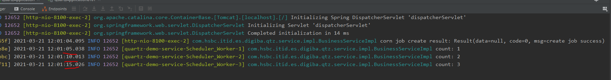

## Quartz
Quartz is a richly featured, open source job scheduling library that can be integrated within virtually any Java application - from the smallest stand-alone application to the largest e-commerce system.

### 1. quartz-common
please find quartz-common project to get more details.

### 2. Integration 

```xml
        <dependency>
            <groupId>com.hsbc.itid.es.digiba</groupId>
            <artifactId>quartz-common</artifactId>
            <version>1.0</version>
        </dependency>
```

```yaml
spring:
  application:
    name: quartz-demo-service
  datasource:
    dynamic:
      enable: true
    core:
      jdbcUrl: jdbc:mysql://127.0.0.1:3306/release?useUnicode=true&characterEncoding=utf-8&allowMultiQueries=true&useSSL=false&serverTimezone=Asia/Shanghai&allowPublicKeyRetrieval=true
      username: root
      password: 123456
      driver-class-name:  com.mysql.cj.jdbc.Driver
    quartz:
      jdbcUrl: jdbc:mysql://127.0.0.1:3306/quartz?useUnicode=true&characterEncoding=utf-8&allowMultiQueries=true&useSSL=false&serverTimezone=Asia/Shanghai&allowPublicKeyRetrieval=true
      username: root
      password: 123456
      driver-class-name:  com.mysql.cj.jdbc.Driver
```

```java
package com.hsbc.itid.es.digiba.qtz;

import com.hsbc.itid.es.digiba.quartz.EnableQuartz;
import org.mybatis.spring.annotation.MapperScan;
import org.springframework.boot.SpringApplication;
import org.springframework.boot.autoconfigure.SpringBootApplication;
import org.springframework.boot.autoconfigure.jdbc.DataSourceAutoConfiguration;

@SpringBootApplication(exclude = {DataSourceAutoConfiguration.class})
@EnableQuartz
@MapperScan(
        basePackages = {"com.hsbc.itid.es.digiba.quartz.mapper","com.hsbc.itid.es.digiba.qtz.dao"}
)
public class QuartzApplication {

    public static void main(String[] args) {
        SpringApplication.run(QuartzApplication.class,args);
    }

}
```

create scheduler job business
```java
@Component("userTask")
@Slf4j
public class UserServiceTask {

    @Autowired
    private ObjectMapper objectMapper;

    public void release(String params) throws JsonProcessingException {
        Business business = objectMapper.readValue(params,Business.class);
        log.info("Business: {} ",business);
    }

```

### 3. Testing

#### 3.1 custom time scheduler job
 
post a request to http://127.0.0.1:8080/monitor/job/add

    jobName:Job Name
    jobGroup:quartz-demo-service
    invokeTarget:userTask.release()
    concurrent:0
    status:0
    misfirePolicy:2
    params:{↵	"id": "1",↵	"name": "test",↵	"status": "P"↵}
    triggerType:1
    startTime:2021-03-20 19:12:45


#### 3.2 cron scheduler job
post a request to http://127.0.0.1:8080/monitor/job/add

    jobName:Job Name
    jobGroup:quartz-demo-service
    invokeTarget:userTask.release()
    concurrent:0
    status:0
    params:{↵	"id": "1",↵	"name": "test",↵	"status": "P"↵}
    triggerType:0
    cronExpression:*/10 * * * * ?


#### 3.3 cluster
1. Base on 3.2 job data
2. Start two service and setup port=8100 and 8101.

Only one service(port=8100) can execute the scheduler job.


Stop 8100 service, we can see that 8081 service will start execute the scheduler job


3 Add more scheduler job, and then we can see that the tasks are run evenly on each micro service

### 4. Business usage
1. /cron/count This api is simulate count the total number of users
2. /release  normal user release api
3. /release/custom custom release time api

#### 4.1 Code
```java
package com.hsbc.itid.es.digiba.qtz.controller;

import com.fasterxml.jackson.core.JsonProcessingException;
import com.hsbc.itid.es.digiba.qtz.entity.Business;
import com.hsbc.itid.es.digiba.qtz.service.BusinessService;
import com.hsbc.itid.es.digiba.quartz.entity.Result;
import org.springframework.beans.factory.annotation.Autowired;
import org.springframework.web.bind.annotation.GetMapping;
import org.springframework.web.bind.annotation.PostMapping;
import org.springframework.web.bind.annotation.RestController;

@RestController
public class ApiController {


    @Autowired
    private BusinessService businessService;

    @PostMapping("/cron/count")
    public Result count(Business business) throws Exception {
        return businessService.releaseByCorn(business);
    }

    @GetMapping("/release")
    public boolean release(Business business) throws JsonProcessingException {
        return businessService.release(business);
    }

    @PostMapping("/release/custom")
    public Result releaseCustom(Business business) throws Exception {
        return businessService.releaseByCustomTime(business);
    }

}


```

```java
package com.hsbc.itid.es.digiba.qtz.service.impl;

import com.fasterxml.jackson.core.JsonProcessingException;
import com.fasterxml.jackson.databind.ObjectMapper;
import com.hsbc.itid.es.digiba.qtz.dao.BusinessDao;
import com.hsbc.itid.es.digiba.qtz.entity.Business;
import com.hsbc.itid.es.digiba.qtz.service.BusinessService;
import com.hsbc.itid.es.digiba.quartz.constant.ScheduleConstants;
import com.hsbc.itid.es.digiba.quartz.entity.Result;
import com.hsbc.itid.es.digiba.quartz.entity.SysJob;
import com.hsbc.itid.es.digiba.quartz.service.ISysJobService;
import lombok.extern.slf4j.Slf4j;
import org.springframework.beans.factory.annotation.Value;
import org.springframework.stereotype.Service;

import java.util.List;
import java.util.concurrent.TimeUnit;
import java.util.concurrent.atomic.AtomicInteger;

@Service("businessService")
@Slf4j
public class BusinessServiceImpl implements BusinessService {

    private BusinessDao businessDao;

    private ObjectMapper objectMapper;

    private ISysJobService iSysJobService;

    public BusinessServiceImpl(BusinessDao businessDao,ObjectMapper objectMapper,ISysJobService iSysJobService){
        this.businessDao = businessDao;
        this.iSysJobService = iSysJobService;
        this.objectMapper = objectMapper;
    }

//    @Autowired
//    private Scheduler scheduler;
//    @PostConstruct
//    public void init() throws SchedulerException {
//        scheduler.clear();
//    }


    @Value("${spring.application.name}")
    private String JOB_GROUP;

    @Override
    public List<Business> selectAll(){
        return businessDao.selectAll();
    }

    private static AtomicInteger atomicInteger = new AtomicInteger();

    @Override
    public boolean release(Business business) throws JsonProcessingException {

        //valid
        try {
            TimeUnit.SECONDS.sleep(1000);
        } catch (InterruptedException e) {
            e.printStackTrace();
        }

        //doRelease
        return doRelease(objectMapper.writeValueAsString(business));

    }

    @Override
    public Result releaseByCorn(Business business) throws Exception {
        SysJob sysJob = new SysJob();
        sysJob.setJobName("XXX Cron Count Job");
        sysJob.setJobGroup(JOB_GROUP);
        sysJob.setInvokeTarget("businessService.countTotalUser()");
        sysJob.setCronExpression(business.getCornExpression());
        sysJob.setTriggerType(ScheduleConstants.TriggerType.CRON.getValue());
        //sysJob.setParams(objectMapper.writeValueAsString(business));
        Result resultInsert = iSysJobService.insertJob(sysJob);
        log.info("corn job create result: {}",resultInsert);
        return resultInsert;
    }

    @Override
    public Result releaseByCustomTime(Business business) throws Exception  {
        SysJob sysJob = new SysJob();
        sysJob.setJobName("XXX Release Job");
        sysJob.setJobGroup(JOB_GROUP);
        sysJob.setInvokeTarget("businessService.doRelease()");
        sysJob.setStartTime(business.getReleaseTime());
        sysJob.setTriggerType(ScheduleConstants.TriggerType.SIMPLE.getValue());
        sysJob.setParams(objectMapper.writeValueAsString(business));
        Result resultInsert = iSysJobService.insertJob(sysJob);
        log.info("corn job create result: {}",resultInsert);
        return resultInsert;
    }

    public void countTotalUser() throws JsonProcessingException {
        int count = atomicInteger.incrementAndGet();
        log.info("count: {} ",count);
    }


    public boolean doRelease(String params) throws JsonProcessingException {
        Business business = objectMapper.readValue(params,Business.class);
        log.info("Business: {} ",business);
        return true;
    }

}

```

#### 4.2 Testing

##### /cron/count
>http://127.0.0.1:8100/cron/count

form-data:
        
    id:1
    name:test
    status:P
    cornExpression:*/5 * * * * ?




##### /release/custom
>http://127.0.0.1:8100/release/custom

id:1
name:test
status:P
releaseTime:2021-03-21 12:04:38


